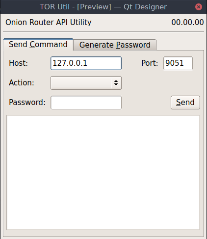

# tor-util
Utility for TOR(The Onion ROUTER) such as requesting a new IP, or generating API password. Uses Network API for control

Writen in python using Qt5, with accompanying CLI app, this app is for sending
API calls over the network to a running TOR daemon.

This app also can generate hashed passwords for use with the daemon.

Currently in early stages with a UI mockup done.

Mockup UI
---------

