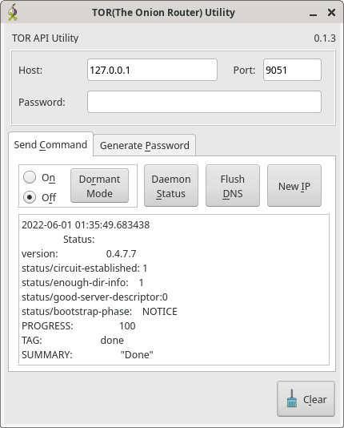

# tor-util
TOR(The Onion ROUTER), Network API Utility. Send Signals to TOR Daemons using
the TOR control API. Can also generate HashedControlPassword lines for torrc.

Written in Python. GUI uses Qt5, with PyQt5.

Status: four commands implemented: Dormant/Active, Flush DNS, and signal newnym

nextgen interface is a mockup for a more complete version with more nyx like
features in Qt.

GUI
---
  

Command Line
------------
```
TOR API Commands:
	new_ip		Sends the NEWNYM command which gets a new IP. This
generates new tunnels, and with it, a new exit node that has a new IP.

	flush_dns		Flushes DNS cache on TOR daemon.

	dormant_mode \__	Turns Dormant Mode on/off. Newish feature to TOR
	active_mode  /
    
	tor_version		Queries the TOR Daemon version

Local Utilities(Commands):
	gen_passwd_hash		Generates a password hash for use in torrc.
    
	touch_config		Quit after generating config. useful for first
run

positional arguments:
  command               See above for description of commands

optional arguments:
  -?, --help            Show This Help Message
  -t, --password-prompt
                        Prompt for password. overrides settings
  -w PASSWORD, --password PASSWORD
                        Password. overrides settings
  -V, --version         Print Version and Exit

Network:
  Network Settings for send commands

  -h HOST, --host HOST  Address/hostname of TOR daemon
  -p PORT, --port PORT  Port of TOR daemon
```
