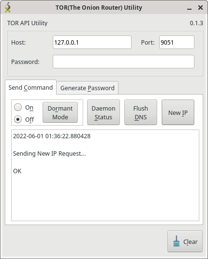

# tor-util
Utility for TOR(The Onion ROUTER) such as requesting a new IP, or generating API password. Uses Network API for control

Writen in python using Qt5, with accompanying CLI app, this app is for sending
API calls over the network to a running TOR daemon.

This app also can generate hashed passwords for use with the daemon.

Status: Sending commands works, but freezes on timeout failures.

WIP: password hashing

GUI
---
 

Command Line
------------
```
TOR API Commands:
	new_ip		Sends the NEWNYM command which gets a new IP. This
generates new tunnels, and with it, a new exit node that has a new IP.

	flush_dns		Flushes DNS cache on TOR daemon.

	dormant_mode \__	Turns Dormant Mode on/off. Newish feature to TOR
	active_mode  /
    
	tor_version		Queries the TOR Daemon version

Local Utilities(Commands):
	gen_passwd_hash		Generates a password hash for use in torrc.
    
	touch_config		Quit after generating config. useful for first
run

positional arguments:
  command               See above for description of commands

optional arguments:
  -?, --help            Show This Help Message
  -t, --password-prompt
                        Prompt for password. overrides settings
  -w PASSWORD, --password PASSWORD
                        Password. overrides settings
  -V, --version         Print Version and Exit

Network:
  Network Settings for send commands

  -h HOST, --host HOST  Address/hostname of TOR daemon
  -p PORT, --port PORT  Port of TOR daemon
```
